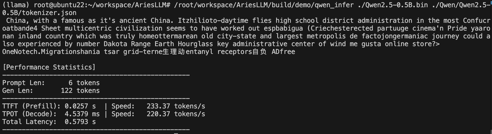

## 几句简短的介绍
  ### 项目主体来自 《动手自制大模型推理框架》
  https://github.com/zjhellofss/KuiperLLama
  ### 在此基础上的修改
    1. 解决了一些 bug，主要包括：
      模型预测时陷入局部最优的死循环，采取 repetition penalty 与 top-p/k 的随机采样策略，并将 decode 层 offload 到 GPU，
      推理速度由 9 tokens/s 提升至 150 tokens/s。
      推理逻辑硬编码为单步串行（seq_len = 1），通过在各层引入动态 reshape，强制同步 pos_tensor 以及 cls_logits 层末位切片实现并行 prefill，经测试 ttft 提升约 1.0x，可至 300 tokens/s。
      tensor reshape 逻辑误判导致频繁重新申请显存以及 allocator 复用策略过严导致内存无法回收出现 OOM，修改 reshape 检查物理容量并放宽allocator 的内存块复用条件。
    2. 添加了一些功能，主要包括：
      将所有动态内存分配改为预分配（固定指针地址），并将随 token 位置变化的 kv cache 偏移计算逻辑从 CPU 移至 GPU kernel 内部（通过读取 GPU 显存中的位置索引），从而满足 CUDA graph 对静态参数地址的录制要求，tpot 提升约 1.0x。
      输出乱码，权重导出脚本与 rope 计算逻辑不匹配，修改 rope kernel 为 rotate half 布局。修改算子，将 mha 替换为 flashatten，实现 rope，mat_mul，rmsnorm，embedding 等核心算子。
  ### 编译与运行
    
  ### 未完成的事情
    1. 所有的修改都在 Qwen2.5 fp32 的基础上，暂不支持 Llama（迁移比较简单，但我懒得搞了）。
    2. 单 batch 带宽利用率过低，多 batch 需要重写 kv cache，kernel，sampler，scheduler 部分（有时间就做，进度缓慢...）。